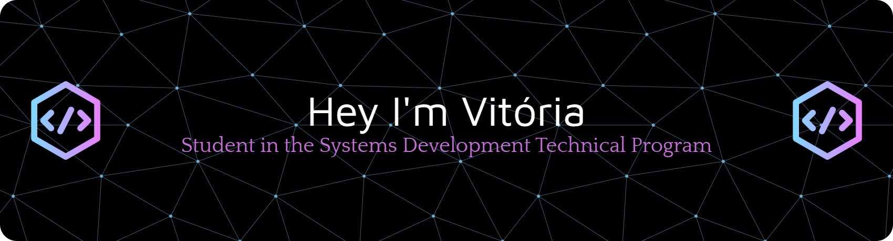

<p align="center">
  
</p>
<div align="center">

<div align="center">


</div>

---

## 👩‍💻 About me

```javascript
const vitoria = {
  name: "Vitória Kishimoto",
  location: "Jundiaí, SP 🇧🇷",
  school: "ETEC · Systems Development",
  contact: "kishimoto.vitoria@gmail.com"
};
```

---

## 🛠️ Tech Stack & Tools

<div align="center">


</div>

---

## 📊GitHub Stats

<div align="center">


</div>

<div align="center">

[](https://git.io/streak-stats)

</div>

---

## Currently learning

- 📐 Logic programming & algorithms
- 🌐 Creating web pages using HTML & CSS
- 🎯 Developing practical projects for my academic portfolio
---

## ➤ Find me here

<div align="center">

[](https://linkedin.com/in/vitoria-kishimoto)
[](mailto:kishimoto.vitoria@gmail.com)
[](https://github.com/vikishimoto)

</div>

---

</div>


